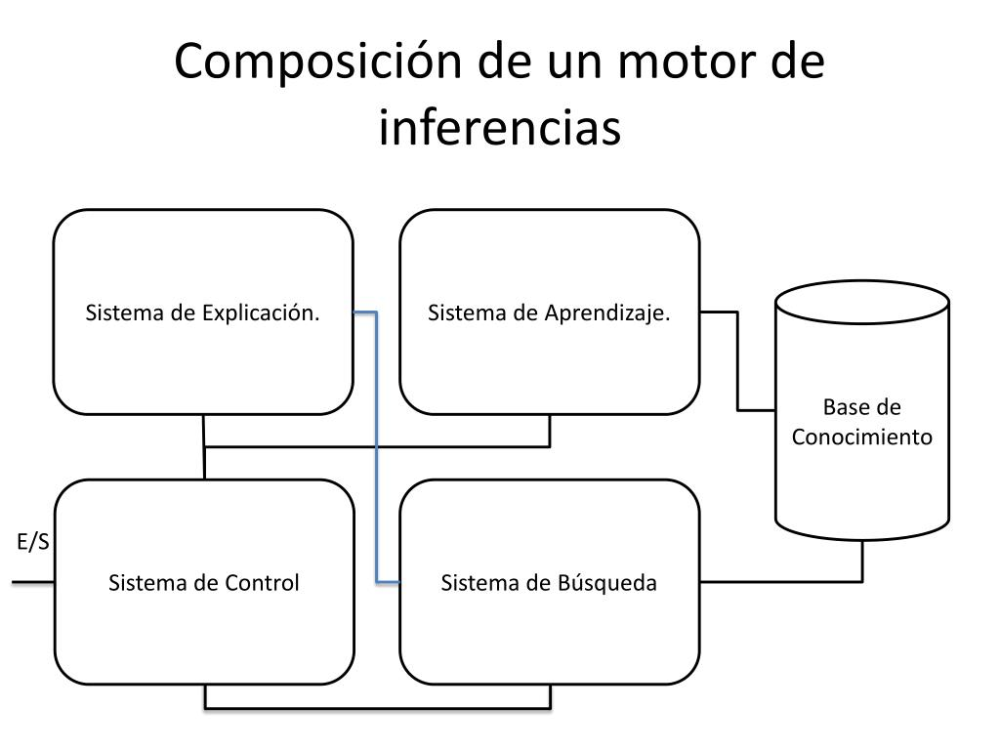

# Motores de inferencia 

Primero debemos definir de que trata un motor de inferencia, de acuerdo con la Experta en tecnologíaMargaret Rouse, en la página web https://www.techopedia.com/es/definicion/motor-inferencia

**Define por motor de inferencia como:** una herramienta utilizada para hacer deducciones lógicas sobre los activos de conocimiento. Esto quiere decir que es desde un punto de vista mecánico, como el el componente que almacena una base de conocimientos como si de un cerebro o computador se hablara.

## Entonces, ¿Cuáles son los motores de inferencia en la actualidad?

Hoy en día desde la perspectiva de la Inteligencia Artifical el motor de inferencia sirve como un componente escencial el cual aplica reglas lógicas o bien, modelos entrenados para deducir conclusiones a partir de datos nuevos. Permitiendose generar predicciones o toma de decisiones en tiempo real 

## Esquema de un motor de inferencia 

1. Base de Conocimiento

    - Representada como un cilindro a la derecha.
    - Qué es: Contiene hechos, reglas, datos y conocimientos que el motor puede usar para tomar decisiones.
    - Función: Fuente principal de información para todos los demás sistemas. Puede actualizarse dinámicamente (por ejemplo, mediante aprendizaje).

  -------------------------------
2. Sistema de Explicación

    - Ubicado en la parte superior izquierda.
    - Qué es: Módulo que genera explicaciones sobre las decisiones del motor de inferencias.
    - Función: Permite al usuario entender por qué el motor tomó una determinada decisión o respondió de cierta manera.
    - Ejemplo: “Elegí esta respuesta porque coincide con estas reglas y datos de la base de conocimiento”.

-----------------------------------
3. Sistema de Aprendizaje

    - Parte superior central.
    - Qué es: Módulo encargado de actualizar el conocimiento o mejorar la inferencia.
    - Función: Permite al motor aprender de nuevas situaciones, datos o respuestas que se le enseñan.
    - Ejemplo: Si el motor no conoce una respuesta, el sistema de aprendizaje permite agregarla a la base de conocimiento.
-------------------------------------

4. Sistema de Control

    - Parte inferior izquierda.
    - Qué es: Coordina todas las operaciones del motor de inferencias.
    - Función: Dirige el flujo de información entre los sistemas de búsqueda, aprendizaje, explicación y la base de conocimiento.
    - Entrada/Salida (E/S): Se encarga de recibir las consultas del usuario y devolver las respuestas procesadas.
-----------------------------------
5. Sistema de Búsqueda

    - Parte inferior derecha.
    - Qué es: Módulo que localiza la información relevante dentro de la base de conocimiento.
    - Función: Analiza la consulta, compara con los datos existentes y selecciona los elementos necesarios para generar la inferencia.
    - Interacción: Envía la información al sistema de control y al sistema de explicación para que el usuario obtenga la respuesta adecuada.
-----------------------------------
### Flujo general

1. El usuario ingresa una consulta (E/S).

2. El Sistema de Control recibe la consulta y decide qué módulos deben actuar.

3. El Sistema de Búsqueda busca la información relevante en la Base de Conocimiento.

4. El Sistema de Aprendizaje puede actualizar la base si hay nueva información.

5. El Sistema de Explicación genera un reporte o justificación sobre la inferencia.

6. El Sistema de Control envía la respuesta final al usuario.

## ¿Cuáles se usan en la actualidad?

**A:**  Basados en reglas (Rule-Based Engines)

Estos usan reglas del tipo “si … entonces …” para deducir conclusiones.

----
**B:** Basados en lógica difusa (Fuzzy Logic Engines)

Utilizan reglas difusas para manejar incertidumbre o datos imprecisos.

----

**C:** Basados en probabilidades

Se basan en redes bayesianas, Markov o razonamiento probabilístico.

-------

**D:** Basados en aprendizaje automático (ML/DL)

Algunos motores de inferencia moderna combinan reglas con ML.

-------

## Ejemplos de algunos motores y sus tipos: 
| Tipo           | Motor representativo     | Uso típico                             |
| -------------- | ------------------------ | -------------------------------------- |
| Reglas         | Drools, Jess, CLIPS      | Sistemas expertos, automatización      |
| Difuso         | FuzzyLite, jFuzzyLogic   | Control de procesos, robótica          |
| Probabilístico | HUGIN, GeNIe, PyMC       | Diagnóstico médico, análisis de riesgo |
| ML/DL          | TensorFlow, ONNX Runtime | IA moderna, visión artificial, NLP     |
