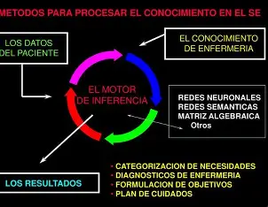

# Métodos de motores de inferencia en sistemas expertos

  

Los motores de inferencia en sistemas expertos utilizan diferentes métodos para razonar y deducir conclusiones a partir de un conjunto de datos o conocimiento previamente establecido. 

**Estos métodos incluyen:**

1. Razonamiento hacia adelante *(Forward Chaining)*: Parte de datos iniciales y aplica reglas para llegar a conclusiones. Útil en sistemas de diagnóstico para determinar causas a partir de síntomas observados. 

2. Razonamiento hacia atrás *(Backward Chaining)*: Comienza con una hipótesis o meta y trabaja hacia atrás para comprobar. Es más rápido que el prorazonamiento y se utiliza cuando hay múltiples variables de meta o reglas. 

3. Prorazonamiento: También conocido como encadenamiento hacia adelante, las reglas se examinan una tras otra en cierto orden. 

4. Razonamiento inverso: También llamado encadenamiento hacia atrás, selecciona una regla y la considera como un problema a resolver. 

5. Estos métodos permiten a los sistemas expertos razonar y tomar decisiones basadas en el conocimiento disponible, aplicando reglas lógicas y lógicas difusa para generar decisiones o predicciones.